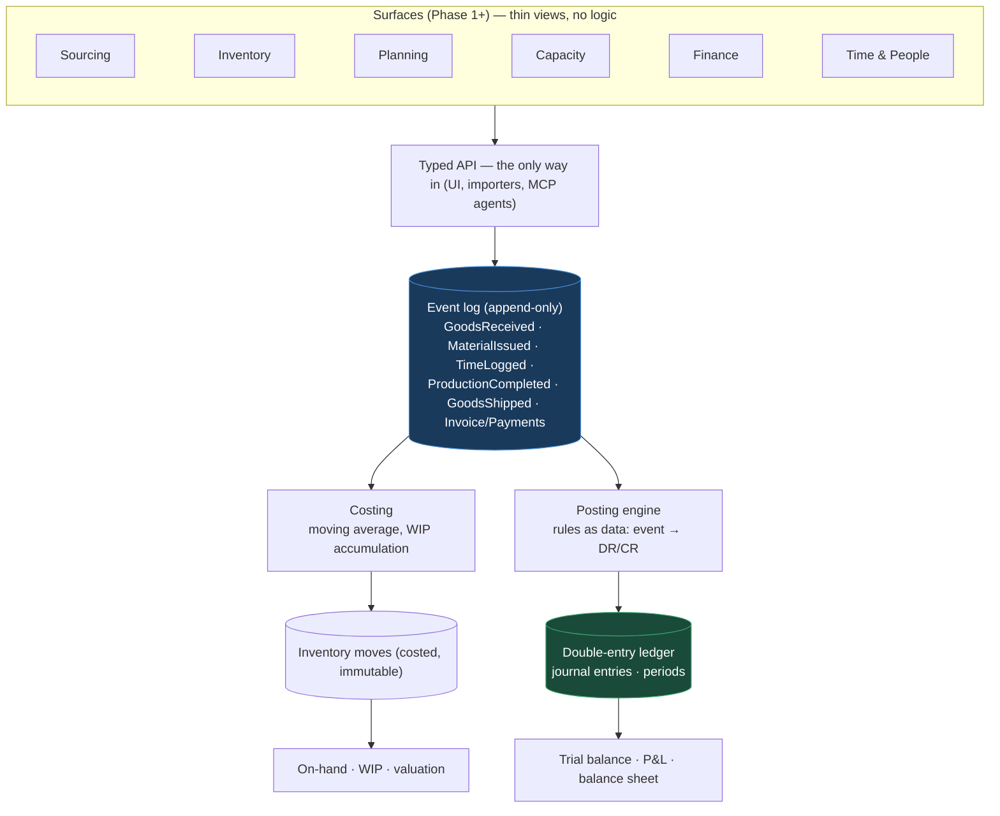

# Kernel architecture

Companion to the full sketch in the project folder
(`02-Architecture-Design/Simple-ERP_Architecture-Sketch_2026-07-28.md`).

## Posting rules (as seeded, v1)

| Event | Debit | Credit |
|---|---|---|
| GoodsReceived | Inventory (raw/finished by item) | GRNI 2110 |
| BillPosted | GRNI 2110 | Accounts payable 2100 |
| PaymentMade | Accounts payable 2100 | Cash 1110 |
| MaterialIssued | WIP 1330 | Inventory 1310 |
| TimeLogged | WIP 1330 | Labor absorbed 5290 |
| ProductionCompleted | Finished goods 1350 | WIP 1330 |
| GoodsShipped | COGS 5110 | Finished goods 1350 |
| InvoiceIssued | Accounts receivable 1200 | Revenue 4100 |
| PaymentReceived | Cash 1110 | Accounts receivable 1200 |
| AdjustmentMade | Inventory ↔ Shrinkage 5150 (side by sign of delta) | |

## Invariants the kernel enforces

1. Events are append-only (database trigger) — corrections are reversing events.
2. Every journal entry traces to exactly one event (`journal_entries.event_id` unique).
3. Debits equal credits within every entry by construction (paired lines share one amount).
4. Inventory can't go negative (rejected at ingest).
5. All writes for one event share one transaction — no partial states exist, ever.
